# 📰 Gnews Jekyll Theme (Free Version)

Gnews es un tema minimalista y rápido para blogs de noticias. Esta versión gratuita incluye el esquema de color **Purple** por defecto.

## ✨ Características
- Diseño responsive.
- Modo oscuro manual.
- Optimizado para SEO.
- Botones para compartir
- Manifest para PWA en movil Android y IOS
- Pagina de categorias y autor
- Provedores de Comentarios Integrado

## 💎 ¿Quieres más?
Obtén **Gnews Premium** para acceder a:
- 5 esquemas de colores (Cyan, Ruby, Coffee, Sunset, Emerald).
- Cambio dinámico de Temas en Comentarios.
- Espacios publicitarios optimizados.
- Busquedas en tiempo real.
- Mejor Respuesta en Articulos.
- Integaracion con ADS para publicidad.

## 👀👀 Capturas de la version
| Home (Skin Purple) | Vista de Artículo |
|:---:|:---:|
| 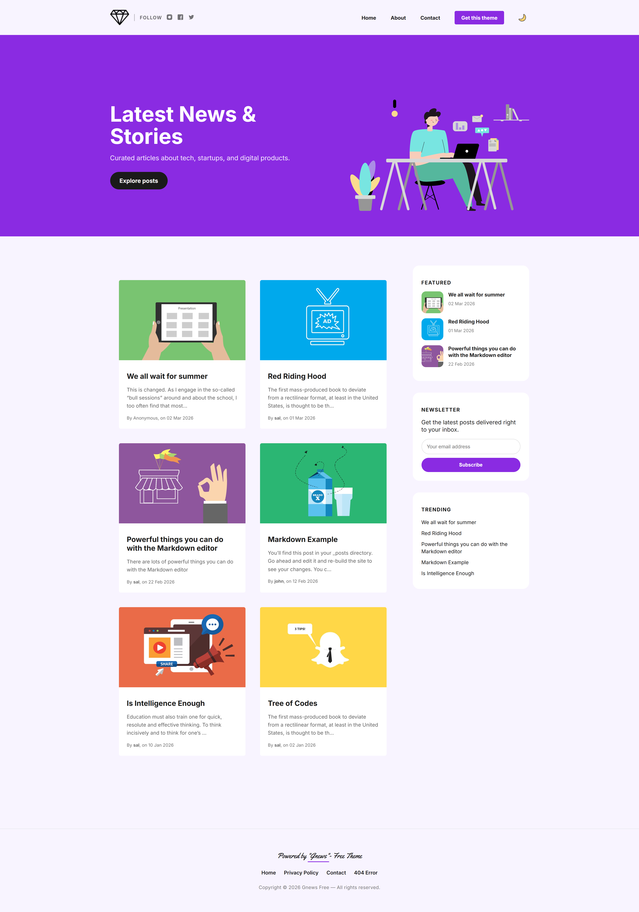 | 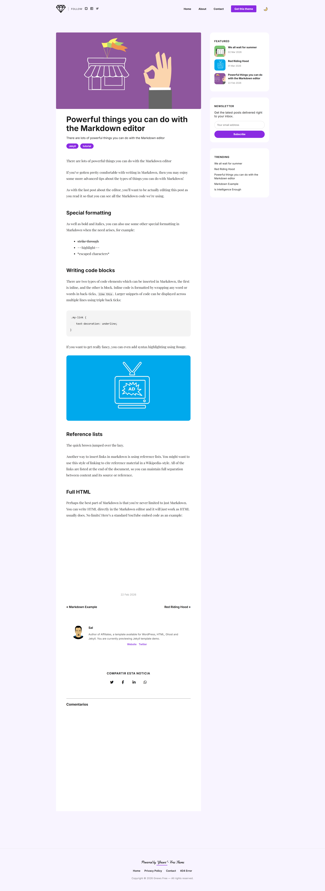 |
| *Vista principal del tema* | *Lectura optimizada y barra lateral* |

| Modo Oscuro | Versión Móvil |
|:---:|:---:|
| 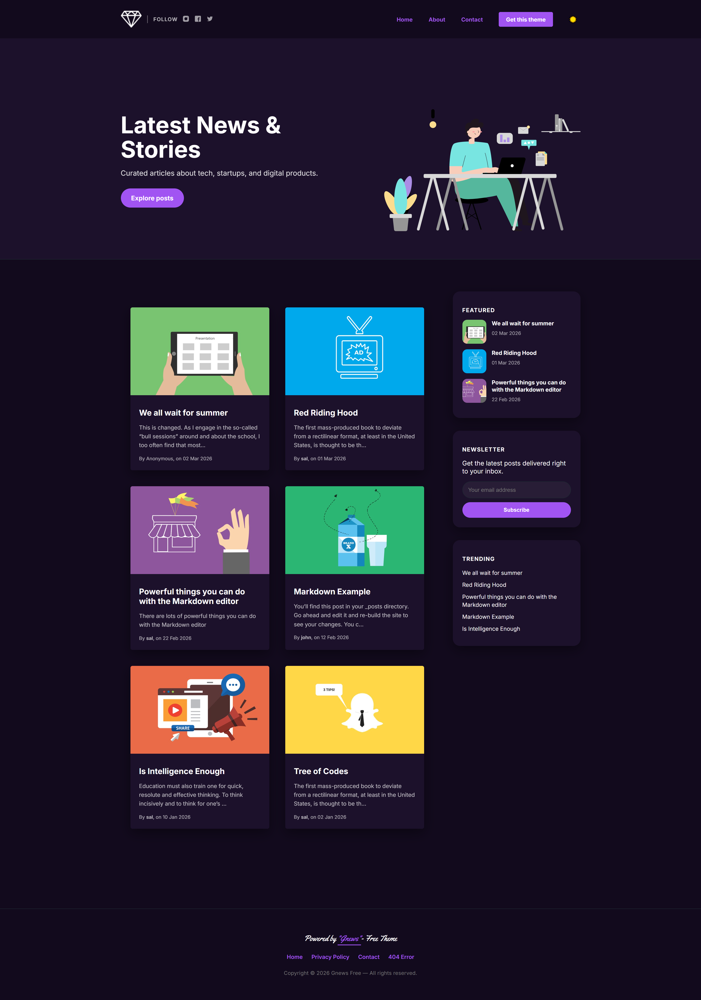 | 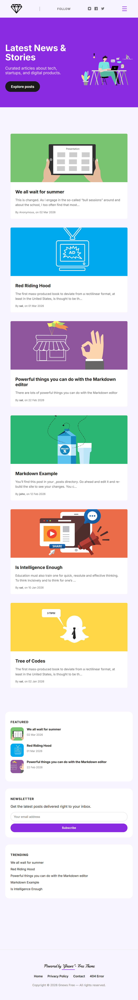 |
| *Interfaz adaptativa en modo noche* | *Diseño responsive a una sola columna* |

### 🌗 Alterna entre modo dia y noche 
| Modo Claro | Modo Oscuro |
|:---:|:---:|
|  | 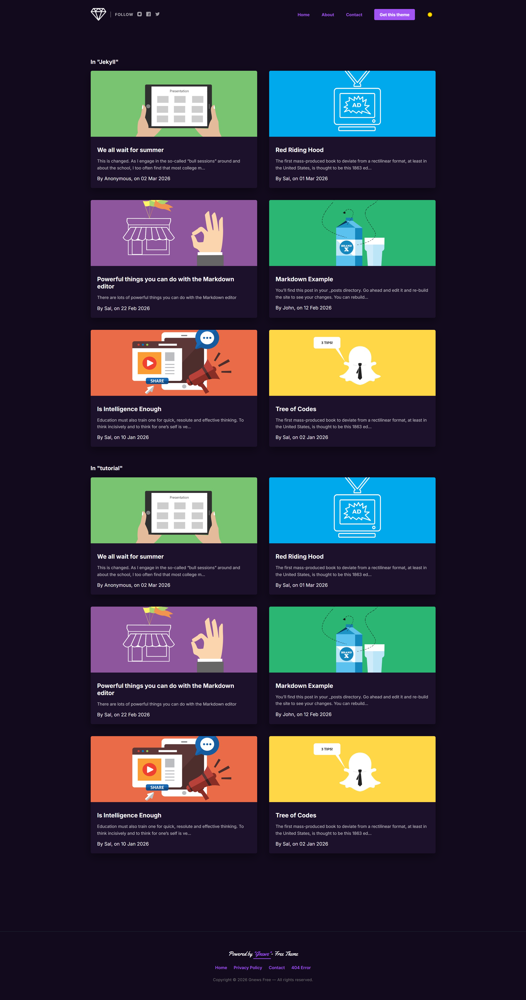 |
| *Interfaz fluida y minimalista* | *Diseño nocturno adaptable* |

## 😱 Comparativa con el modo sencillo y premium

**Aunque**, este tema fue hecho princialmente para una pagina de contenido de infomacion perosnal que estaba por montar decidi minimizar las implementaciones para dar una version mas ligera y menos cargada de codigo para la perosna que desee hacer uso del mismo pero no deje la posibilidad que veas un poco de lo que llegue hacer con este tema y si queires obtener todas sus funciones deje una version full cargada de los siguientes anadidos

## 😱 Comparativa: Free vs Premium

| Característica | Gnews Free | Gnews Premium |
| :--- | :---: | :---: |
| **Diseño Responsive** | ✅ | ✅ |
| **Modo Oscuro Manual** | ✅ | ✅ |
| **Optimización SEO** | ✅ | ✅ |
| **Soporte PWA** | ✅ | ✅ |
| **Botones compartir** | ✅ | ✅ |
| **Esquemas de colores** | 1 (Purple) | 5 (Multicolor) |
| **Búsqueda en Tiempo Real** | ❌ | ✅ |
| **Temas dinámicos en Comentarios** | ❌ | ✅ |
| **Espacios Publicitarios (ADS)** | ❌ | ✅ |
| **Barra de lectura Pro** | ❌ | ✅ |
| **Soporte Prioritario** | ❌ | ✅ |

---

> 🚀 **¿Listo para el siguiente nivel?**
> [Adquirir Gnews Premium ahora](TU_ENLACE_AQUI)

## 🐨🐨 Imagenes comparativas y animaciones

A continuación puedes ver en acción algunas de las funciones principales y la fluidez de la interfaz.

### 🌏 HOME PAGE (Diseno)
Muestra de la inetrfaz y su funcionamiento en mabas versiones con diseno minimalista inspirado en el tema Affiliates pero a mi gusto sin usar Bootstrap solo SCSS y HTML puro (los espacios publicitarios solo se pueden agregar en a version premium del mismo).

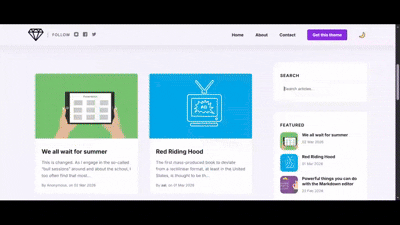

### 📲 Adpatabilidad (Versión Movil)
Con los estandares de diseno responsivo de los ultimos tiempos se agrego la funcionalidad de adaptabilidad a diferentes tamanos de pantalla.


### 🔍 Búsqueda en Tiempo Real (Versión Premium)
Con la versión Premium, los usuarios pueden encontrar contenido instantáneamente sin recargar la página.

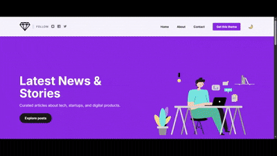


### 🌓 Cambio de Modo y Diseño Skins
Compara cómo se adapta visualmente el tema al cambiar entre el modo claro y oscuro.

| Vista General (Día) Purple | Vista General (Noche) Purple |
|:---:|:---:|
|  |  |

Compara los esquemas de colores disponibles para ti en la version premium

| Vista General (Día) Ruby | Vista General (Noche) Ruby |
|:---:|:---:|
| 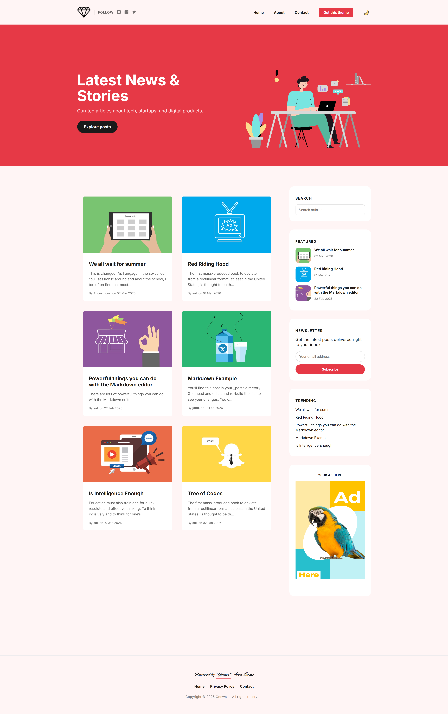 | 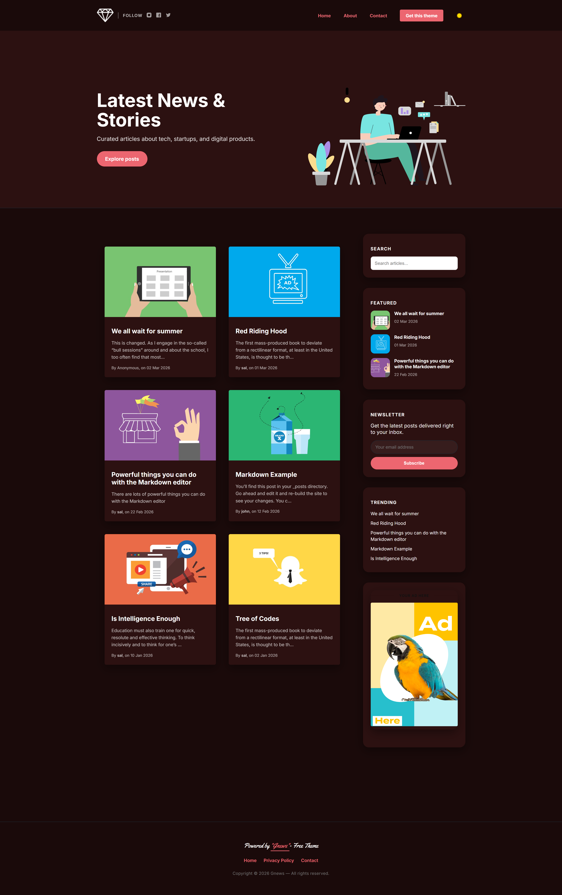 |

| Vista General (Día) Coffee | Vista General (Noche) Coffe |
|:---:|:---:|
| 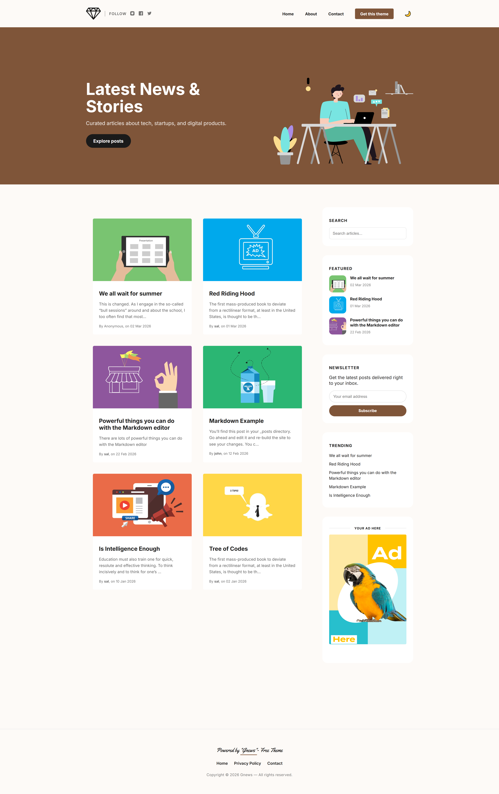 | 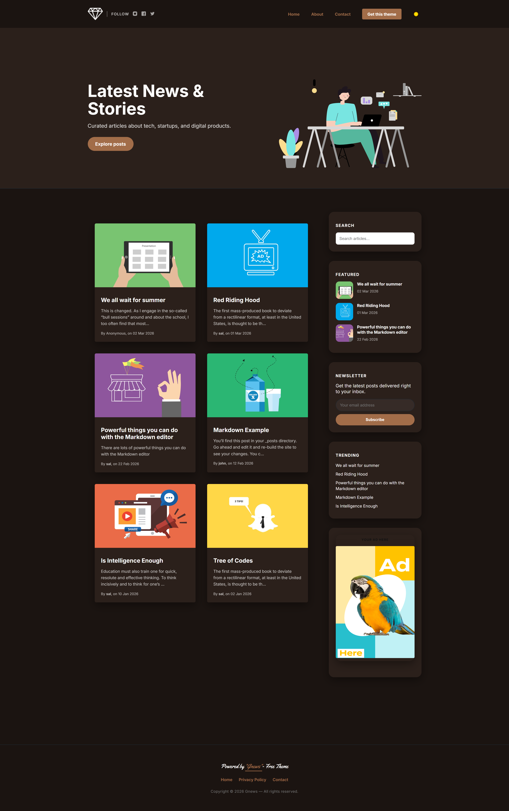 |

| Vista General (Día) Cyan | Vista General (Noche) Cyan |
|:---:|:---:|
| 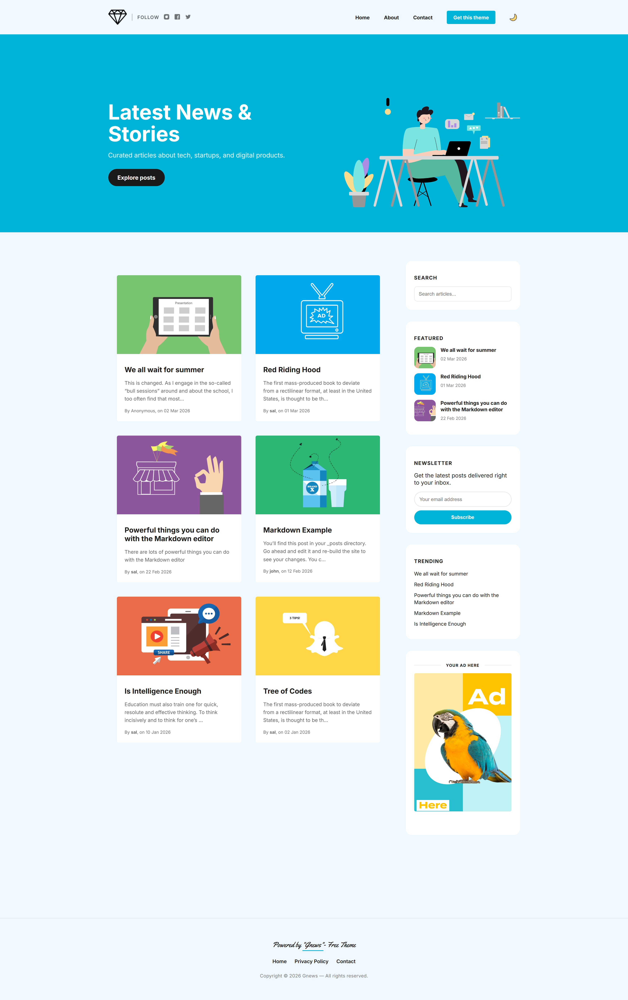 | 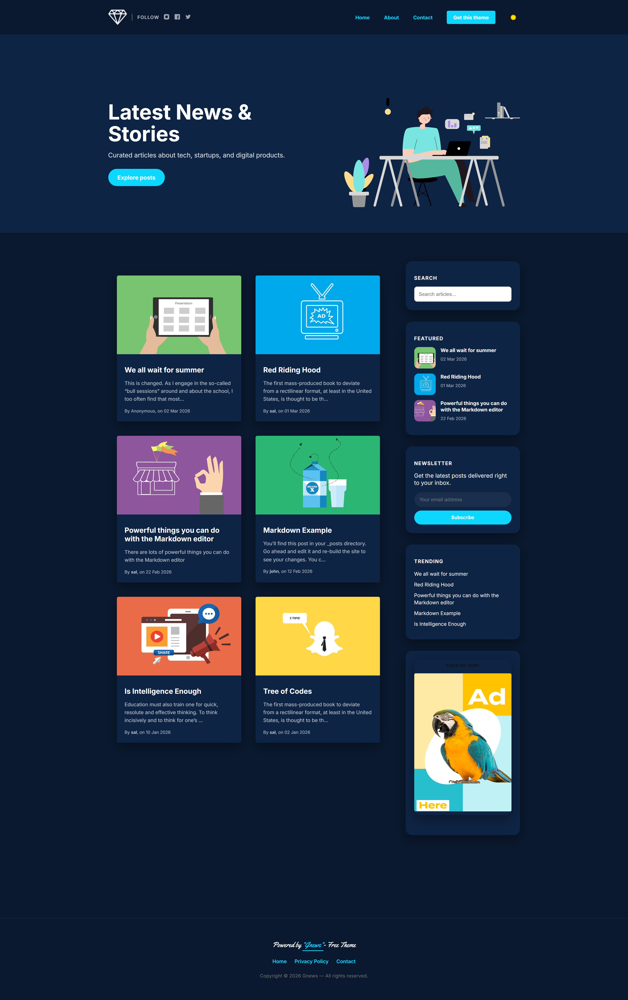 |

## 🚀 Modo de uso

### 🛠️ Requisitos previos
- Tener instalado **Ruby** (versión 3.0 o superior).
- Tener instalado **Jekyll** y **Bundler**.

### 👍 Instalación del tema

1. **Clonar el repositorio:**
   ```bash
   git clone [https://github.com/tu-usuario/gnews-free.git](https://github.com/tu-usuario/gnews-free.git)
   cd gnews-free

Instalar dependencias:
Ejecuta el siguiente comando para instalar todas las gemas necesarias (incluyendo el motor de Jekyll):

Bash
bundle install
Configuración inicial:
Edita el archivo _config.yml con la información de tu sitio (título, descripción, url, etc.).

💻 Ejecución en local
Para ver el tema funcionando en tu computadora:
```
Bash
bundle exec jekyll serve
Luego abre tu navegador en http://localhost:4000.
```
📦 Compilación para producción (Despliegue)
Si vas a subir el sitio a un hosting que no sea GitHub Pages (como un servidor compartido), debes generar el sitio estático:

Bash
bundle exec jekyll build
Esto creará una carpeta llamada _site/ con todo el código HTML/CSS final. ¡Solo tienes que subir el contenido de esa carpeta a tu servidor!


---

### 2. ¿Cómo se "compila" técnicamente el tema?

Jekyll es un generador de sitios estáticos. El proceso de "compilación" sigue esta lógica:

1.  **Lectura:** Jekyll lee tus archivos `.md` (Markdown), `_layouts`, `_includes` y los datos del `_config.yml`.
2.  **Procesamiento (Liquid):** Sustituye todas las etiquetas `{{ }}` y `` por el contenido real.
3.  **Conversión:** Transforma el Markdown en HTML y el SASS en CSS plano.
4.  **Salida:** Todo se deposita en la carpeta `_site/`.

> 🚀 **¿Listo para el siguiente nivel?**
> [Adquirir Gnews Premium ahora](TU_ENLACE_AQUI)

## 📄 Licencia
Este tema es de código abierto bajo la licencia MIT.